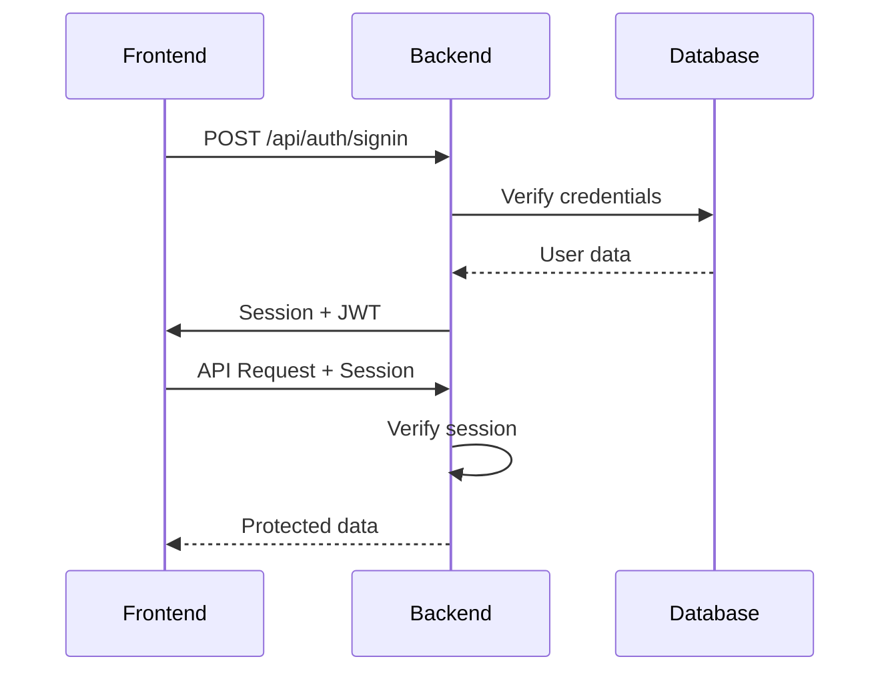

# 🔄 KIẾN TRÚC BACKEND-FRONTEND RELATION

## 📊 Tổng Quan Architecture

```
┌─────────────────────────────────────────────────────────┐
│                     FRONTEND (Client)                    │
├─────────────────────────────────────────────────────────┤
│  Next.js 14 App Router │ React 18 │ TypeScript         │
│  ├── Pages (31 routes)                                  │
│  ├── Components (63)                                    │
│  ├── Hooks (WebSocket, etc.)                           │
│  └── Client Services                                    │
└────────────┬───────────────────────────┬────────────────┘
             │                           │
             │ HTTP/HTTPS                │ WebSocket
             │ (REST API)                │ (Real-time)
             ▼                           ▼
┌─────────────────────────────────────────────────────────┐
│                     BACKEND (Server)                     │
├─────────────────────────────────────────────────────────┤
│  API Routes (34)     │  WebSocket Server (Port 3001)    │
│  ├── /api/auth/*     │  ├── Socket.io                   │
│  ├── /api/payments/* │  ├── JWT Auth                    │
│  ├── /api/webhooks/* │  ├── Rooms/Namespaces           │
│  └── /api/user/*     │  └── Event Handlers              │
├─────────────────────────────────────────────────────────┤
│                 Database (PostgreSQL)                    │
│            Prisma ORM - 18 Models - Supabase            │
└──────────────────────────────────────────────────────────┘
```

---

## 1. 🌐 COMMUNICATION CHANNELS

### 1.1 REST API Communication

**Protocol:** HTTP/HTTPS **Format:** JSON **Authentication:** NextAuth.js (JWT)

```typescript
// Frontend → Backend
const response = await fetch('/api/payments/create', {
  method: 'POST',
  headers: { 'Content-Type': 'application/json' },
  body: JSON.stringify({ bookingId, paymentMethod })
})
```

### 1.2 WebSocket Communication

**Protocol:** WebSocket (ws://) **Library:** Socket.io **Port:** 3001 **Authentication:** Custom JWT
token

```typescript
// Frontend Hook
const socket = io('http://localhost:3001', {
  auth: { token },
  transports: ['websocket', 'polling']
})
```

---

## 2. 🔐 AUTHENTICATION FLOW

### 2.1 HTTP Authentication (NextAuth.js)



### 2.2 WebSocket Authentication

```typescript
// 1. Frontend requests WS token
GET /api/auth/ws-token → { token: 'jwt...' }

// 2. Frontend connects with token
const socket = io(WS_URL, {
  auth: { token }
})

// 3. Backend verifies token
socket.on('connection', async (socket) => {
  const { token } = socket.handshake.auth
  const userId = await verifyJWT(token)
  socket.userId = userId
})
```

---

## 3. 📁 PROJECT STRUCTURE MAPPING

### Frontend Structure

```
src/app/                    # Pages (Next.js App Router)
├── (public)/              # Public pages
│   ├── page.tsx           # Homepage
│   ├── services/          # Services pages
│   └── contact/           # Contact page
├── auth/                  # Authentication pages
│   ├── signin/
│   └── signup/
├── dashboard/             # Protected dashboard
│   ├── bookings/          # User bookings
│   ├── payments/          # Payment history
│   └── messages/          # Chat interface
└── admin/                 # Admin panel

src/components/            # React Components
├── BookingChat.tsx        # Real-time chat
├── RealtimeNotifications.tsx
└── payment/              # Payment components

src/hooks/                 # Custom Hooks
└── useWebSocket.ts        # WebSocket connection
```

### Backend Structure

```
src/api/                   # API Routes
├── auth/                  # Authentication
│   ├── [...nextauth]/     # NextAuth handler
│   └── ws-token/          # WebSocket token
├── payments/              # Payment operations
│   └── create/            # Create payment
├── webhooks/              # Payment webhooks
│   ├── vnpay/
│   ├── momo/
│   └── zalopay/
└── user/                  # User operations

src/lib/                   # Backend Services
├── websocket/             # WebSocket server
│   ├── secure-server.ts   # Socket.io implementation
│   └── init.ts           # Initialization
├── payments/              # Payment gateways
│   ├── vnpay.ts
│   ├── momo.ts
│   └── zalopay.ts
└── webhooks/              # Webhook processing
    ├── processor.ts
    └── retry-service.ts
```

---

## 4. 🔄 DATA FLOW PATTERNS

### 4.1 Booking Creation Flow

```typescript
// 1. Frontend submits form
const booking = await createBooking({
  serviceTierId,
  requirements,
  startDate
})

// 2. Backend creates record
POST /api/bookings/create
→ Prisma: booking.create()
→ Send email notification
→ Emit WebSocket event

// 3. Real-time update to dashboard
socket.emit('booking:created', booking)
→ Frontend updates UI instantly
```

### 4.2 Payment Processing Flow

```typescript
// 1. Frontend initiates payment
const payment = await initiatePayment({
  bookingId,
  method: 'vnpay'
})

// 2. Backend creates payment URL
→ Create payment record
→ Generate gateway URL
→ Return redirect URL

// 3. User completes payment
→ Gateway sends webhook
→ Backend processes webhook
→ Update payment status
→ Emit WebSocket event

// 4. Frontend receives real-time update
socket.on('payment:completed', (data) => {
  updatePaymentStatus(data)
})
```

---

## 5. 🚀 REAL-TIME FEATURES

### 5.1 WebSocket Events

**Frontend → Backend:**

```typescript
// Subscribe to booking updates
socket.emit('booking:subscribe', bookingId)

// Send chat message
socket.emit('chat:send', { bookingId, message })

// Typing indicator
socket.emit('chat:typing', { bookingId, isTyping })
```

**Backend → Frontend:**

```typescript
// Broadcast to room
io.to(`booking:${bookingId}`).emit('chat:message', message)

// Payment updates
socket.emit('payment:update', { status, amount })

// Status changes
socket.emit('booking:statusUpdate', { status })
```

### 5.2 Room-Based Architecture

```typescript
// Backend: Join user to rooms
socket.join(`user:${userId}`) // Personal notifications
socket.join(`booking:${bookingId}`) // Booking-specific updates

// Broadcast to specific room
io.to(`booking:${bookingId}`).emit('update', data)
```

---

## 6. 🎯 KEY INTEGRATION POINTS

### 6.1 Shared Types

```typescript
// src/types/webhook-payloads.ts
export interface VNPayWebhookParams { ... }
export interface MoMoWebhookPayload { ... }

// Used by both frontend & backend
```

### 6.2 Environment Variables

```bash
# Frontend needs
NEXT_PUBLIC_WS_URL=http://localhost:3001
NEXT_PUBLIC_SITE_URL=http://localhost:3000

# Backend needs
WS_PORT=3001
JWT_SECRET=...
DATABASE_URL=...
```

### 6.3 API Response Format

```typescript
// Consistent API responses
interface ApiResponse<T> {
  success: boolean
  data?: T
  error?: string
  message?: string
}
```

---

## 7. 📊 PERFORMANCE OPTIMIZATIONS

### 7.1 Frontend Optimizations

- **SWR/React Query** for data caching
- **Optimistic updates** for better UX
- **Lazy loading** components
- **Code splitting** by route

### 7.2 Backend Optimizations

- **Database queries** optimized (no N+1)
- **Connection pooling** (PgBouncer)
- **Rate limiting** on all endpoints
- **WebSocket scaling** ready

### 7.3 Communication Optimizations

- **Compression** enabled (gzip)
- **CDN** for static assets
- **WebSocket fallback** to polling
- **Batch operations** where possible

---

## 8. 🔒 SECURITY MEASURES

### 8.1 Frontend Security

- **CSP headers** configured
- **XSS protection** via sanitization
- **HTTPS only** in production
- **Secure cookies** for auth

### 8.2 Backend Security

- **JWT validation** on every request
- **Rate limiting** (50-100 req/min)
- **CORS** properly configured
- **Input validation** with Zod
- **SQL injection** prevented via Prisma

### 8.3 WebSocket Security

- **Token authentication** required
- **Room authorization** checks
- **Message sanitization**
- **Rate limiting** per socket

---

## 9. 🚨 MONITORING & DEBUGGING

### 9.1 Frontend Monitoring

```typescript
// Error boundaries
<ErrorBoundary>
  <Component />
</ErrorBoundary>

// Performance monitoring
import { PerformanceMonitor } from '@/components/monitoring'

// Analytics
gtag('event', 'payment_completed', { value })
```

### 9.2 Backend Monitoring

```typescript
// Logging
import { getLogger } from '@/lib/monitoring/logger'
logger.info('Payment processed', { orderId })

// Sentry integration
Sentry.captureException(error)

// Health checks
GET /api/health → { status: 'ok', db: 'connected' }
```

---

## 10. 🎯 DEPLOYMENT ARCHITECTURE

### Production Setup

```
┌────────────────────────────────────────┐
│          Vercel (Frontend)              │
│     Next.js App + API Routes           │
└─────────────┬──────────────────────────┘
              │
              ├─── HTTPS ──→ Users
              │
              ├─── WebSocket ──→ Socket.io Server (separate)
              │
              └─── PostgreSQL ──→ Supabase
```

### Development Setup

```
- Frontend: http://localhost:3000
- WebSocket: http://localhost:3001
- Database: Supabase Cloud
```

---

## 11. 📈 SCALABILITY CONSIDERATIONS

### Horizontal Scaling

- **Frontend:** Vercel auto-scales
- **WebSocket:** Redis adapter for multiple instances
- **Database:** Read replicas for queries

### Vertical Scaling

- **Optimize queries** with indexes
- **Cache frequently** accessed data
- **Queue heavy tasks** with Bull/Redis

---

## 12. 🔑 KEY TAKEAWAYS

1. **Separation of Concerns**
   - Frontend handles UI/UX
   - Backend handles business logic
   - WebSocket handles real-time

2. **Type Safety**
   - Shared TypeScript types
   - Zod validation schemas
   - Prisma generated types

3. **Real-time First**
   - WebSocket for instant updates
   - Fallback to polling
   - Optimistic UI updates

4. **Security by Default**
   - Auth on all channels
   - Input validation everywhere
   - Rate limiting throughout

5. **Performance Focus**
   - Optimized queries
   - Efficient caching
   - Minimal network calls
